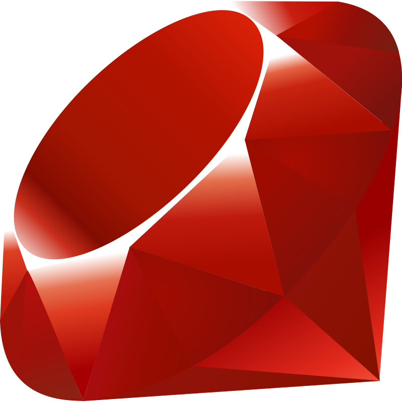
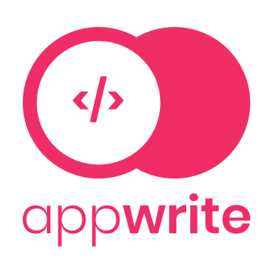

## HEY THERE - I AM AWAIS AMJED 
<br><br>
<p align="center">
  
</p>
<br>

### HERE IS SOME INFORMATION ABOUT ME &nbsp; 


```js
var awaisAmjed = {
  currentStatus: "Full-stack Web Developer at LOOFT Inc.",
  lookingForOppurtunitiesIn: "Full Stack Web Development" && "Mobile Development with Flutter",
  languages: [Dart, JavaScript, Ruby, HTML, CSS, Python, Java, SQL],
  frameworks: [Flutter, ReactJS, NextJS, Ruby on Rails],
  tools: [Firebase, Supabase, Vite, AWS, GCP, Azure],
  qualification: "Computer Scientist",
  passions: Flutter && React,
  hobbies: ["Gaming", "Watching Movies", "Listening to Music"],
  weirdFact: "I code while watching horror movies",
}
```
<br>

### TECHNOLOGIES &nbsp; 

<a href="https://flutter.dev/"></a>&nbsp;&nbsp;&nbsp;&nbsp;
<a href="https://dart.dev/"></a>&nbsp;&nbsp;&nbsp;&nbsp;
<a href="https://react.dev/"></a>&nbsp;&nbsp;&nbsp;&nbsp;
<a href="https://vitejs.dev/"></a>&nbsp;&nbsp;&nbsp;&nbsp;
<a href="https://www.javascript.com/"></a>&nbsp;&nbsp;&nbsp;&nbsp;
<a href="https://www.w3schools.com/html/"></a>&nbsp;&nbsp;&nbsp;&nbsp;
<a href="https://firebase.google.com/"></a>&nbsp;&nbsp;&nbsp;&nbsp;
<a href="https://supabase.com/"></a>&nbsp;&nbsp;&nbsp;&nbsp;
<a href="https://www.python.org/"></a>&nbsp;&nbsp;&nbsp;&nbsp;
<a href="https://www.ruby-lang.org/"></a>&nbsp;&nbsp;&nbsp;&nbsp;
<a href="https://rubyonrails.org/"></a>&nbsp;&nbsp;&nbsp;&nbsp;
<a href="https://www.postgresql.org/"></a>&nbsp;&nbsp;&nbsp;&nbsp;
<a href="https://www.java.com/"></a>&nbsp;&nbsp;&nbsp;&nbsp;
<a href="https://aws.amazon.com/"></a>&nbsp;&nbsp;&nbsp;&nbsp;
<a href="https://azure.microsoft.com/"></a>&nbsp;&nbsp;&nbsp;&nbsp;
<a href="https://appwrite.io/"></a>

### MY GITHUB STATISTICS &nbsp; 

[](https://github.com/anuraghazra/github-readme-stats)
[](https://github.com/anuraghazra/github-readme-stats)

### WAKATIME STATS &nbsp; 

[](https://github.com/anuraghazra/github-readme-stats)


### BADGES & CERTIFICATES &nbsp; 

[](https://api.accredible.com/v1/frontend/credential_website_embed_image/badge/52033964)&nbsp;&nbsp;
[](https://api.accredible.com/v1/frontend/credential_website_embed_image/badge/52033964)&nbsp;&nbsp;
[](https://api.accredible.com/v1/frontend/credential_website_embed_image/badge/52033964)&nbsp;&nbsp;
[](https://api.accredible.com/v1/frontend/credential_website_embed_image/badge/49817923)&nbsp;&nbsp;
[](https://api.accredible.com/v1/frontend/credential_website_embed_image/certificate/47857885)&nbsp;&nbsp;
[](https://api.accredible.com/v1/frontend/credential_website_embed_image/certificate/45950717)&nbsp;&nbsp;
[](https://dev.to/badge/appwrite-hackathon-on-dev-e2-80-94-participant)&nbsp;&nbsp;&nbsp;&nbsp;&nbsp;&nbsp;&nbsp;&nbsp;
[](https://www.udemy.com/certificate/UC-68648df5-a16c-44bc-9305-bf8e1aaa239e/)


